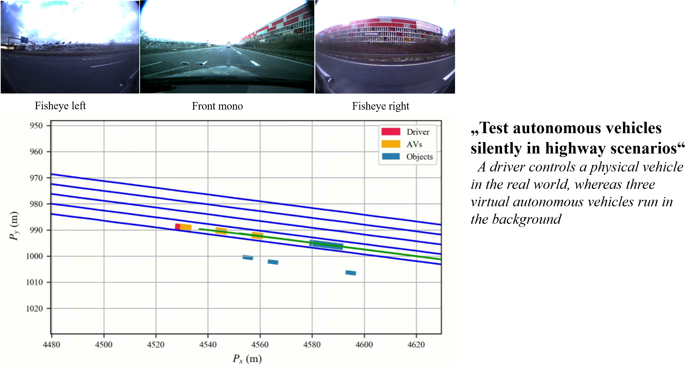
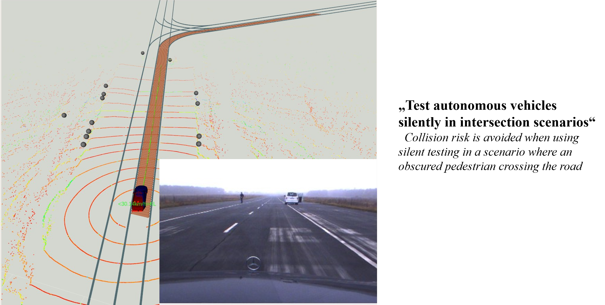

**Test partial functions or capabilities** of an autonomous vehicle in the *background* without intervention in the physical vehicle

Testing capabilities
======

Urban scenarios

This is an item in your portfolio. It can be have images or nice text. If you name the file .md, it will be parsed as markdown. If you name the file .html, it will be parsed as HTML. 
